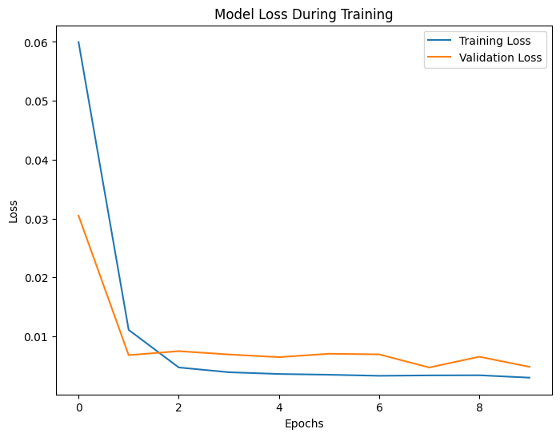

# Ethereum Price Prediction

Author: Utsav Singh
Description:
A machine learning project to predict Ethereum (ETH-USD) prices using Long Short-Term Memory (LSTM) neural networks. This project fetches historical Ethereum price data using `yfinance`, processes it for training, and predicts future prices while visualizing the results.

## Table of Contents

- [Project Overview](#Project-Overview)
- [Key features](#Key-features)
- [Setup and Installation](#Setup-and-Installation)
- [Project Structure](#project-structure)
- [Code Explanation](#Code-Explanation)

## Project Overview
In this project, we use yfinance to gather historical price data for Ethereum and preprocess it for training the LSTM model. The model is then trained on this data and used to predict the next 30 days of Ethereum prices. The predicted prices are visualized to help users understand the trend and potential future movements in the price of Ethereum.

This project demonstrates how machine learning can be applied to cryptocurrency price forecasting, offering valuable insights for investors and enthusiasts looking to make data-driven decisions in the cryptocurrency market.

## Key features

- Data Collection: Fetches historical Ethereum price data using yfinance.
- Data Preprocessing: Scales and reshapes the data to fit the LSTM input format.
- Model Training: Uses LSTM networks to train on historical Ethereum price data.
- Price Prediction: Predicts Ethereum's price for the next 30 days.
- Visualization: Displays actual vs predicted price data using graphs to visualize trends.

## Setup and Installation

To run this project locally, please follow the steps below:
1. Clone the repository or save the code as app.py.
2. Install the required packages by running:
```
pip install yfinance pandas numpy matplotlib scikit-learn tensorflow
```

## Project Structure

The project has the following structure:
notebook for training and predictions │ ├── crypto_price_prediction.py # Python script to train and predict cryptocurrency prices ├── requirements.txt # Required libraries and dependencies └── README.md # This file

## Code Explanation

# Importing Libraries
```
import yfinance as yf
import pandas as pd
import numpy as np
import matplotlib.pyplot as plt
from sklearn.preprocessing import MinMaxScaler
from tensorflow.keras.models import Sequential
from tensorflow.keras.layers import LSTM, Dense
from datetime import timedelta     # For date manipulation
from sklearn.metrics import mean_squared_error  # For evaluating model performance
```
- yfinance: Used to fetch historical price data from Yahoo Finance.
- pandas: For data manipulation and handling.
- numpy: For numerical operations, especially on arrays.
- matplotlib: For visualizing the results (plots).
- MinMaxScaler: To scale the data between 0 and 1, which is required for neural network training.
- tensorflow.keras: Used for building the LSTM (Long Short-Term Memory) model for time series prediction.
- datetime.timedelta: Adds or subtracts a specific duration to/from a given date, essential for generating future dates in predictions.
- sklearn.metrics.mean_squared_error: Evaluates model accuracy by calculating the Mean Squared Error between actual and predicted prices.

# Fetching Historical Ethereum Data
The data for Ethereum (ETH) is fetched using yfinance. You can specify the ticker symbol ('ETH-USD') and the time period you are interested in:
```
eth_data = yf.download('ETH-USD', start='2023-01-01', end='2024-12-01')
```
- The start and end parameters define the time range for the data. In this case, it pulls data for Ethereum between January 1, 2023, and January 1, 2024.
- The data DataFrame will contain the historical price data, including columns like Open, High, Low, Close, and Volume.


To print the first few rows of a dataset called eth_data in Python using pandas, the head() function is used
```
print(eth_data.head())
```

# Data Preprocessing
Selecting the 'Close' Price
The model will use the closing price of Ethereum to make predictions:
```
prices = eth_data[['Close']]
```
the current index will be replaced with the default integer index (0, 1, 2, ...). The inplace=True argument ensures that the change is made directly to the prices DataFrame without needing to assign it back

```
prices.reset_index(inplace=True)
```
To check DataFrame contains only the "Close" prices
```
print(prices.head())
```
# Scaling the Data
The data is scaled using MinMaxScaler to ensure that the values fall between 0 and 1, which helps in training the neural network efficiently:
```
scaler = MinMaxScaler(feature_range=(0, 1))
scaled_prices = scaler.fit_transform(prices)
print("Scaled Data:")
print(prices.head())
```
The number of previous data points
```
window_size = 60
```

# Creating Sequences for LSTM
LSTM models require the data to be in a sequence format, where each input contains a set of previous values that help predict the next value. Here, we create sequences of 60 time steps:
```
def prepare_data(data, window_size):
    X, y = [], []
    for i in range(len(data) - window_size):
        X.append(data[i:i + window_size])
        y.append(data[i + window_size])
    return np.array(X), np.array(y)
data = prices['Close'].values
X, y = prepare_data(data, window_size)

```
- X contains the input sequences of 60 time steps (the past 60 days).
- Y contains the corresponding values we want to predict (the next day's closing price).

# Reshaping Data for LSTM
LSTM models expect the input to be in the shape . We reshape the data accordingly:
```
X = X.reshape(X.shape[0], X.shape[1], 1)
print(f"Shape of X: {X.shape}")
print(f"Shape of y: {y.shape}")
```
# Building the LSTM Model
Now, we define and compile the LSTM model:
```
model = Sequential([
    LSTM(50, return_sequences=True, input_shape=(X.shape[1], 1)),
    LSTM(50, return_sequences=False),
    Dense(25),
    Dense(1)
])
model.compile(optimizer='adam', loss='mean_squared_error')
```
summary provides useful information about the layers in the model, including their types, output shapes, the number of parameters, and more
```
model.summary()
```
# Training the Model
The model is trained on the preprocessed data:
```
history = model.fit(X, y, batch_size=32, epochs=10, validation_split=0.1)
print("Model trained successfully!")
```
provided plots the training and validation loss over epochs to visualize how the model's performance evolves during training. This is useful for understanding whether the model is overfitting or underfitting




